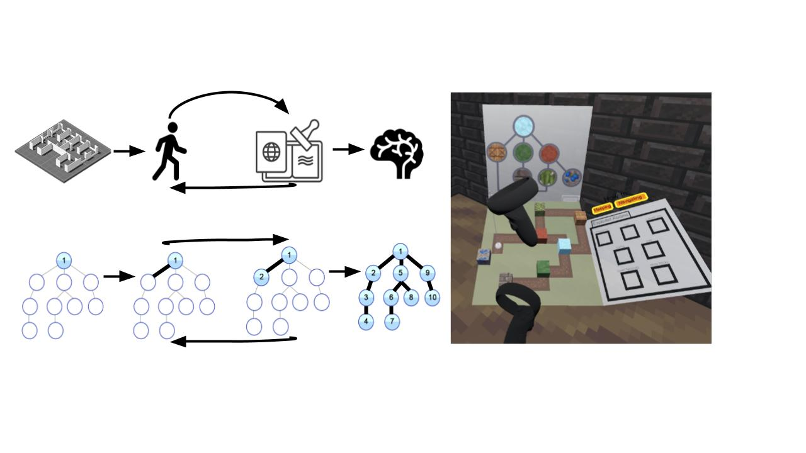

# Walk Me Through It: Using Impossible Spaces to Embody Graph Traversal Algorithms
**Jasmine Joyce DeGuzman, Erik DeVries Smith, Samyok Nepal, Kalinda Miller, Courtney Hutton Pospick, Tongyu Nie, Evan Suma Rosenberg**

## Abstract
When faced with learning new algorithms, students often struggle with recognizing the details of the algorithm or with understanding the meaning of its intermediate stages and interpreting the results. 
These difficulties typically stem from the inherent inadequacies of using static representations to describe dynamic systems. 
We have developed the guided walk-through experience, \textit{Walk Me Through It}, as a way for users to, not only visualize but interact, with every stage of common graph traversal algorithms, Breadth-First Search and Depth-First Search. Users must construct their own map of the room layout and connections between them by collecting room Tokens as they navigate the maze implemented with Flexible Spaces

## Development Environment
This project was created using Godot 4.3.0 and the XR tools plugin. It was developed for the Meta Quest 2 headset but will be compatible for most consumer VR headsets because of OpenXR.

## Third Party Assets
All of our textures were taken from the [Minecraft Wiki](https://minecraft.fandom.com/wiki/Minecraft_Wiki). 