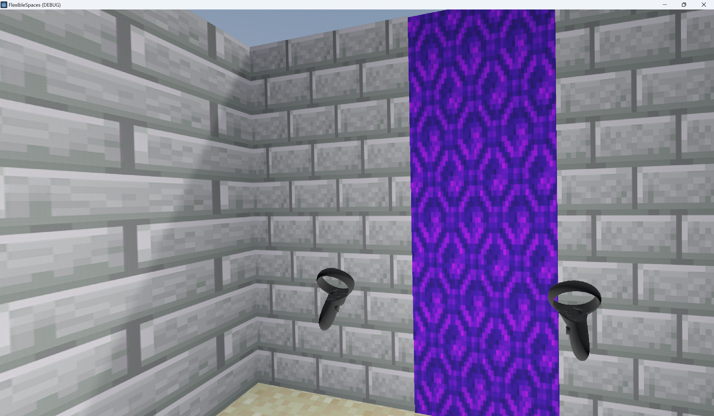

description of the work you performed (what specifically you built), a clear description of your development environment, 
and links to any 3rd party libraries or code that you used. You may also include screenshots or pictures of your implementation working, where appropriate

# CSCI 5619 Final Project
**Samyok Nepal and Jasmine DeGuzman**

For our final project, we decided that we wanted to create an implementation of [Flexible Spaces](https://ieeexplore.ieee.org/document/6549386#full-text-section). 
This is redirection technique extends the the previous work done on Impossible Spaces and change blindness by generalizing the algorithm for dynamic layout generation by automatic rerouting through the 
virtual environment. 

## Description
In the original paper, the corridors are defined as a changeable part of the environment that is rerouted every time the user leaves a room.
The rerouting algorithm randomly selects an intermediate point I between the start position S, defined by the door of the current room, and the 
end position E, defined by the door of the destination room. In order to connect these points, additional randomly selected points are defined between S and I,
as well as I and E.

We found that trying to follow this algorithm outlined in the Flexible Spaces literature did not create a valid path. Instead, we came up with new criteria to create
the shortest possible path between the target

## Development Environment
This project was created using 
---
of the shortest paths, criteria: classic BFS with 
last three points cannot be in destination room, first three meters cannot be in the end room
start one meter out from the door, guaranteed point -- that way when path is made hallway and room walls do not intersect
bfs cannot go int directions oppostie to where it last took, points aren't allowed to go right behind the portal
